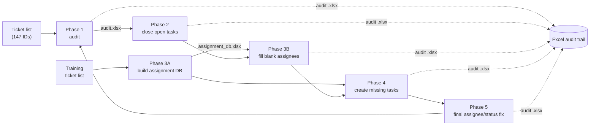

# Enhancement Checks Automation

Five Selenium + Tkinter tools that audited and then repaired the task structure of about 150 enhancement tickets in a support portal: check, close open tasks, learn who should own each task, create missing tasks, fix what's left. Every step leaves an Excel audit trail.


<!-- showcase:banner:start -->
> 🧭 Part of **Abdul Raqeeb Khatri's portfolio**: [📂 Hub](https://github.com/Ark310/portfolio) · [🌐 Site](https://ark310.github.io) · [💼 Experience](https://github.com/Ark310/experience)
<!-- showcase:banner:end -->

## Overview

Before a release, every enhancement ticket had to carry a standard set of review tasks (developer code review, code review 1 and 2, QA development sign-off, release sign-off), each assigned to the right person for that product and closed. The first audit found tickets with missing tasks, blank assignees and tasks left open. Fixing 147 tickets by hand meant opening each ticket, its Tasks/Time iframe and every task's edit form.

The job was split into five focused passes. Each is its own GUI script that logs in once, walks a ticket list, and writes an Excel audit of what it saw and what it changed. Every phase that edits data has a dry-run mode.

| Phase | Script | What it does |
|---|---|---|
| 1 | `phase1_ticket_batch_checker.py` | Audit: QA sign-off and owner fields, Scope Approval records (is there an Enhancement request?), every task with assignee and status, all-closed flag. |
| 2 | `phase2_task_closer.py` | Close every task whose status isn't Closed, ticking the visible checkboxes on the task form. |
| 3 | `phase3_task_assignee_mapper.py` | **A:** learn *project + task description → assignee* from a training list of tickets and save it as an Excel DB (ambiguous choices listed). **B:** fill blank *Assigned To* fields from that DB. |
| 4 | `phase4_task_creator.py` | Create the missing standard tasks with the right task type, assigned from manual overrides first, then the phase 3 DB. |
| 5 | `phase5_task_status_fixer.py` | Final sweep: apply a project/task assignment map (with `*` wildcards) and fix any remaining wrong assignee or non-Closed status. |

<!-- showcase:why-impact:start -->
## 💡 Why I Built It

Before a release every enhancement ticket needed a standard set of review tasks, assigned and closed. An audit found missing tasks, blank assignees and open tasks across 147 tickets, and fixing each by hand meant several forms per ticket.

## 📈 Impact

- Audited and repaired 147 tickets in three working sessions instead of weeks of manual edits.
- Every editing phase has a dry-run mode and writes an Excel audit, which made a risky bulk edit reviewable.
- Learned the correct assignee for each task from correctly set-up tickets instead of relying on a hand-kept mapping.

`147 tickets` · `5 phases` · `3 sessions`
<!-- showcase:why-impact:end -->

## Features

- **GUI per phase**: base URL, credentials, input list, output file, pause between tickets, headless toggle, optional Chrome profile; live log, progress bar and a Stop button.
- **Threaded runs**: Selenium runs on a worker thread and reports through a queue, so the window stays responsive.
- **Login on demand**: if the first ticket redirects to the login page, the tool signs in and reloads the ticket.
- **iframe-aware**: switches into the Tasks/Time iframe and handles alerts after each submit.
- **Flexible input**: ticket lists as `.txt`, `.csv` or `.xlsx`.
- **Audit trail**: every phase writes `.xlsx` (or `.csv`) with before/after values, the source of each mapping, and any errors.
- **Auto-managed ChromeDriver** via `webdriver-manager`.

## Tech Stack

Python 3.10+ · Selenium 4 · webdriver-manager · pandas · openpyxl · Tkinter

## Architecture



Phase 1 was re-run after phases 2 and 4 to confirm the fixes.

## Getting Started

```bash
git clone https://github.com/Ark310/enhancement-checks-automation.git
cd enhancement-checks-automation
python -m venv venv
venv\Scripts\activate
pip install -r requirements.txt
python scripts/phase1_ticket_batch_checker.py
```

Start with a short ticket list and **Dry run** on. Keep Chrome visible until you trust the selectors.

## Configuration

- **Base URL** (GUI field, default in each script): `YOUR_TICKET_SYSTEM_URL/edit_bug.aspx?id=`
- **Selectors**: the `SELECTORS` / `S` dict at the top of each script (login `input#user`, `input#pw`, Tasks link `li#tasks a`, task table `table#mytable`, and so on), written for a classic ASP.NET bug tracker.
- **Standard tasks**: `STANDARD_TASKS` in phase 4 (description → task type).
- **Assignees**: `MANUAL_OVERRIDES` (phase 4) and `PHASE5_ASSIGNMENT_MAP` (phase 5) map `(project, task description)` to a portal username. They ship as `ASSIGNEE_A` … `ASSIGNEE_H` placeholders.

## Project Journey

| Date | Step |
|---|---|
| 2026-05-08 11:55 | **Phase 1** checker built. The first audit of 147 tickets was saved at 13:03 and again after a fix at 13:25. |
| 2026-05-08 14:33 | **Phase 2** task closer. It was run on a list of 102 tickets, and a re-audit ran at 15:29. |
| 2026-05-12 | Debugging the task edit form and project fields from screenshots led to **phase 3**. The assignment DB was built from a training list of 147 tickets (20:45–21:10) and applied at 21:32. |
| 2026-05-12 22:06 | **Phase 4** (v2) creates the missing standard tasks. Its audit and a fresh phase 1 check are dated 2026-05-13 12:30. |
| 2026-05-13 10:18 | **Phase 5** final assignee/status sweep, audit saved at 12:23. The whole cleanup took three working sessions. |
| 2026-05-26 | Portfolio pass: portal URL and colleague usernames replaced with placeholders, `requirements.txt`. |
| 2026-09 | v3 rebuild from the original working folder: dated per-phase history and this README. |

**Lessons:** one small tool per concern, each with a dry run and an audit file, made a risky bulk edit reviewable. Learning assignees from correctly set-up tickets (phase 3) beat hand-maintaining a mapping. A short explicit map (phase 5) was still needed for the cases the data couldn't settle.

History note: never under git. Commits were rebuilt from the original scripts' modification times. The portal host, colleague usernames, a product-line code and a real ticket number were replaced. Ticket lists, Excel audits and debugging screenshots are real data and are not included; only the counts are quoted.

## 🤖 Built with AI

- **Original scripts (May 2026):** built in a ChatGPT workflow. The docstrings still say "Login page selectors based on your screenshot" and "Manual override from your message": screenshots of the portal went in, and working Selenium code came back. About 3,750 lines over three sessions. ChatGPT conversation logs were not kept, so there are no session counts.
- **Claude Code:** the May–June 2026 portfolio pass (placeholders) and the September 2026 rebuild (dated history, sanitization scan: clean, this README).
- **Commits:** 7, each with a `Co-Authored-By: Claude` trailer. **Tests:** none (live portal automation). All five scripts pass `python -m py_compile`.

## License

MIT, see [LICENSE](LICENSE).

<!-- showcase:footer:start -->
---

<p align="center"><a href="https://github.com/Ark310/portfolio">← Back to the portfolio hub</a> · <a href="https://ark310.github.io">Interactive site</a> · <a href="https://github.com/Ark310/experience">Experience</a></p>

**Related projects:** [Report Downloader](https://github.com/Ark310/report-downloader) · [Incident Report Scraper](https://github.com/Ark310/incident-report-scraper) · [Portal Account De-Activator](https://github.com/Ark310/portal-account-deactivator)
<!-- showcase:footer:end -->

## Author

**Abdul Raqeeb Khatri** · [GitHub @Ark310](https://github.com/Ark310)
